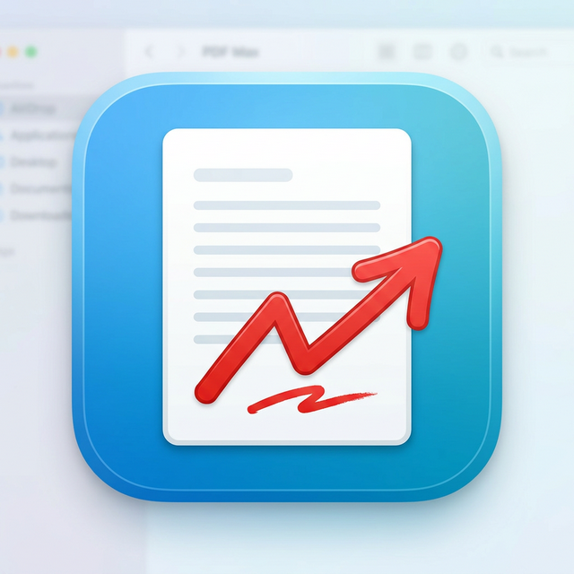

# PDF Max for Mac

**Professional PDF annotation and markup tool for macOS** — built with Electron, Next.js, PDF.js, and Fabric.js.



## Features

- 📄 **Multi-page PDF rendering** — high-fidelity rasterized PDF rendering with PDF.js
- ✏️ **Full annotation suite** — rectangles, clouds, callouts, arrows, freehand, polylines, polygons, text
- 📐 **Measurement tools** — length, area, perimeter, count with real-world scale calibration
- 🔍 **Vector snap engine** — snaps to PDF endpoints, intersections, midpoints, and grid
- 🔤 **OCR** — extract text from scanned PDFs with Tesseract.js
- 🏗️ **DXF import** — load AutoCAD drawings directly
- 💾 **PDF export** — flatten annotations into the exported PDF with pdf-lib
- 📋 **AcroForm fields** — native PDF form field overlay (text, checkboxes, dropdowns)
- ↩️ **Undo / redo** — per-page history
- 🎨 **Layer management** — organize annotations into layers
- 🤖 **AI review panel** — AI-assisted markup review
- 💻 **macOS native** — native menus, file open/save dialogs, traffic-light titlebar

## Architecture

This is a **monorepo** (npm workspaces + Turborepo):

```
PDFMaxv2/
├── apps/
│   ├── web/          # Next.js 16 application (the UI)
│   └── desktop/      # Electron wrapper (macOS .app)
└── packages/
    ├── pdf-engine/   # PDF.js + Fabric.js annotation engine
    └── shared/       # Shared TypeScript types
```

## Getting Started

### Prerequisites
- Node.js 20+
- macOS (for desktop build)

### Install dependencies
```bash
npm install
```

### Run in development (web browser)
```bash
cd apps/web
npm run dev
# → Open http://localhost:3000
```

### Build the macOS app
```bash
# 1. Build the Next.js static export
cd apps/web && ELECTRON=1 npx next build

# 2. Compile the Electron main process
cd ../desktop && npx tsc -p tsconfig.json

# 3. Assemble the .app bundle
bash build-app.sh

# 4. Open it
open "dist/mac-arm64/PDF Max.app"
```

## Download

See the [**Releases**](https://github.com/josephwixom/PDFMax-for-Mac/releases) page for the latest downloadable DMG installer.

## Tech Stack

| Layer | Technology |
|---|---|
| Desktop shell | Electron 35 |
| Web framework | Next.js 16, React 19 |
| PDF rendering | PDF.js |
| Annotation canvas | Fabric.js |
| PDF export | pdf-lib |
| OCR | Tesseract.js |
| State management | Zustand |
| Styling | Tailwind CSS 4 |
| Language | TypeScript |

## Studio & Collaboration (Optional)

The Studio features (shared sessions, real-time collaboration) require a Supabase backend. The app works fully offline without them — all annotation, measurement, OCR, and export features run purely client-side.

## License

MIT
